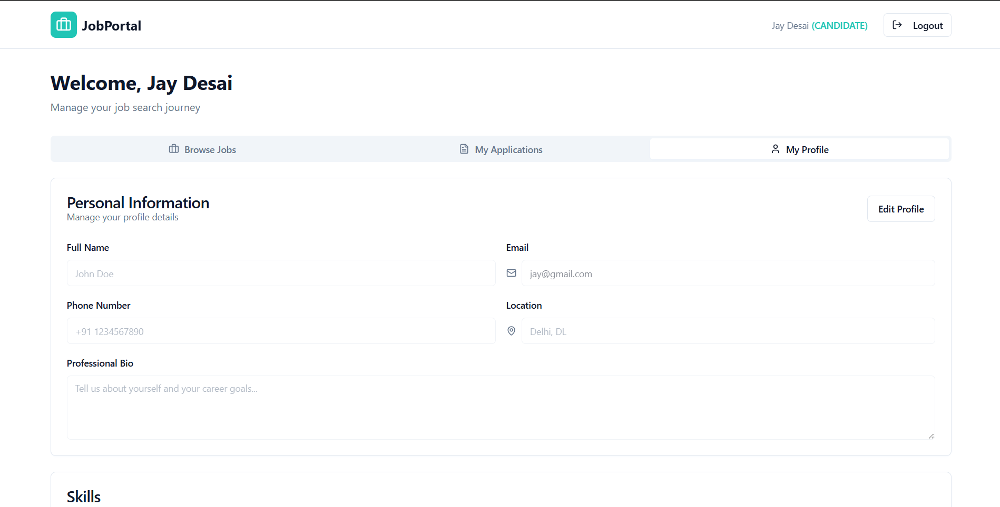

# Job Portal Application

A full-stack web application for managing job postings, job applications, and candidate interactions. Designed for freshers to showcase skills in Spring Boot, MySQL, and ReactJS.

---

## Table of Contents


- Project Overview
- Features
- Tech Stack
- Installation & Setup
- Database Schema
- API Endpoints
- Screenshots
- Future Enhancements
- License


## Project Overview

The Job Portal Application allows users to:

- Register and login securely.

- Post jobs (admin/employer).

- Search for jobs by location and title.

- Apply to jobs as candidates.

- It demonstrates user authentication, CRUD operations, dynamic filtering, and frontend-backend integration using modern web development tools.

## Features

- User Authentication: Register & login securely.

- Job Posting: Employers can post job listings with title, description, company, location, salary, type, and required skills.

- Search Jobs: Users can filter jobs by location or title.

- Apply for Jobs: Users can apply to available jobs.

- Dynamic Dashboard: Employers can view job applications.

- Optional (not implemented but planned):

- Profile updates (phone number, resume upload).

- Email notifications on application.

## Tech Stack

Frontend: ReactJS, Tailwind CSS

Backend: Spring Boot (Java)

Database: MySQL

ORM: JPA/Hibernate

Build Tool: Maven

## Installation & Setup

Backend Setup - 
Clone the repository:
```
git clone <your-backend-repo-url>
cd backend
```

Update application.properties with your MySQL credentials:
```
spring.datasource.url=jdbc:mysql://localhost:3306/jobportal
spring.datasource.username=root
spring.datasource.password=yourpassword
spring.jpa.hibernate.ddl-auto=update
```

Run the Spring Boot application:
```
./mvnw.cmd spring-boot:run
```
Frontend Setup-
Navigate to frontend folder:
```
cd frontend
```

Install dependencies:
```
npm install
```

Start React development server:
```
npm run dev
```
## Database Schema

User: id, name, email, password, role

Job: id, title, description, company, location, salary, type, skillsRequired, employerEmail

Application: id, userId, jobId, status


## API Endpoints
```
Auth

POST /auth/register – Register new user

POST /auth/login – Login user

Jobs

GET /jobs – Get all jobs

POST /jobs – Post new job

GET /jobs/search?location= – Search jobs by location

POST /jobs/apply – Apply for a job

POST /jobs/create - Create a Job post

GET /jobs/employer - List of jobs posted by the Employer

and more..
```
## Screenshots


***Home Page***


***Register Page***


***Login Page***


***Employer Login/Dashboard***


***Employer Posted Jobs***


***Employer Received Applications***

Job Listing

***Candidate Login/Dashboard***


***Candidate Profile***


